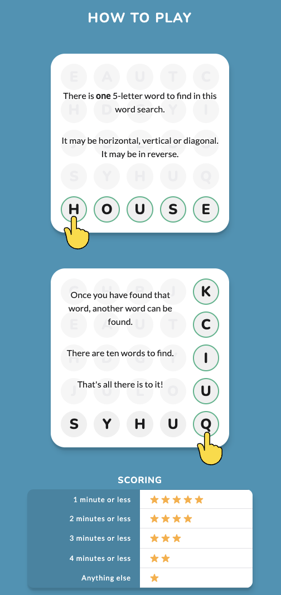
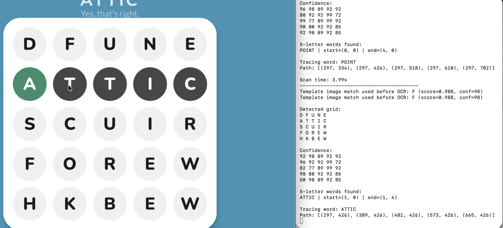

# OneWordSearchAutoPlay

A Python auto-player for the OneWordSearch game. It captures a 5x5 letter grid from the screen, uses OCR and optional saved letter templates to recognize the letters, finds valid 5-letter English words, and can automatically trace the found word on screen.

> Built as a personal automation / computer vision experiment for recognizing and playing OneWordSearch faster.

## How to Play OneWordSearch

OneWordSearch shows a 5x5 grid of letters. The goal is to find valid 5-letter English words by reading in straight lines across the grid.

Words can be found in 8 directions:

- left to right
- right to left
- top to bottom
- bottom to top
- diagonally in any direction

<p align="center">
  
</p>

---

## Demo

See `demo.mov` in this repo for an example run or click the screenshot below to watch the demo video.

<p align="center">
  <a href="demo.mov">
    
  </a>
</p>

---

## Features

- Screen capture of a selected 5x5 game area
- Draggable and resizable capture guide
- OCR-based capital letter recognition with Tesseract
- Backup template matching from previously saved high-confidence letter images
- Word search across 8 directions:
  - left / right
  - up / down
  - diagonals
- Optional auto-click and drag tracing with PyAutoGUI
- Optional saving of letter images for future template matching
- Confidence output for each detected grid cell

---

## How It Works

1. A transparent guide appears on screen.
2. You drag/resize it around the full OneWordSearch letter card.
3. The script captures the screen region every few seconds.
4. Each grid cell is cleaned and passed through OCR/template matching.
5. The script prints the detected grid and valid 5-letter words.
6. If auto-tracing is enabled, it moves the mouse and traces the first found word.

---

## Requirements

This project uses Python and several packages for screen capture, image processing, OCR, and mouse automation. The repo includes a `requirements.txt` with dependencies such as `pytesseract`, `mss`, `Pillow`, `numpy`, `PyAutoGUI`, and `wordfreq`.

You also need the Tesseract OCR engine installed on your machine.

### macOS

Install Tesseract:

```bash
brew install tesseract
```

Install Python dependencies:

```bash
pip install -r requirements.txt
```

### Windows

Install Tesseract from:

```text
https://github.com/UB-Mannheim/tesseract/wiki
```

Then install Python dependencies:

```bash
pip install -r requirements.txt
```

You may also need to point `pytesseract` to your Tesseract install path inside the script, for example:

```python
pytesseract.pytesseract.tesseract_cmd = r"C:\Program Files\Tesseract-OCR\tesseract.exe"
```

---

## Setup

Clone the monorepo and enter this tool's directory:

```bash
git clone https://github.com/eric-r-xu/assortedTooling.git
cd assortedTooling/OneWordSearchAutoPlay
```

Create and activate a virtual environment:

```bash
python -m venv .venv
source .venv/bin/activate
```

On Windows:

```bash
python -m venv .venv
.venv\Scripts\activate
```

Install dependencies:

```bash
pip install -r requirements.txt
```

---

## Running the Auto-Player

Both the light and dark game themes are supported. In the dark theme, the
auto-player locates the 5x5 grid from the regularly spaced white letter bands;
in the light theme, it retains the existing card-based crop.

```bash
python oneWordSearch_autoplay.py
```

A transparent capture guide will appear.

Use the guide to cover the full 5x5 letter card:

* Drag the guide to move it
* Use the arrow keys to move it one pixel at a time
* Hold `Shift` with an arrow key to move it 10 pixels at a time
* Use `Command` + `+` / `Command` + `-` or scroll to resize it
* Press `Enter` or `Space` (or click `Start`) when ready
* Press `Esc` to cancel
* Press `Ctrl+C` in the terminal to stop

Move your mouse to any corner of the screen to stop the program. The capture
loop checks for this every cycle, so it works even when no word is currently
being traced, and it exits cleanly rather than raising the PyAutoGUI failsafe.

---

## Important macOS Permissions

If auto-clicking does not work on macOS, allow your terminal or Python app under:

```text
System Settings → Privacy & Security → Accessibility
```

You may also need screen recording permission:

```text
System Settings → Privacy & Security → Screen Recording
```

---

## Configuration

Most settings are near the top of `oneWordSearch_autoplay.py`.

### Capture timing

```python
AUTO_CAPTURE_SECONDS = 0.25
```

Controls how often the script scans the grid.

### Auto-tracing

```python
AUTO_TRACE_FOUND_WORD = True
TRACE_ONLY_FIRST_WORD = False
```

With `TRACE_ONLY_FIRST_WORD = False`, every English word found in a scan is
traced in sequence. Set `TRACE_ONLY_FIRST_WORD = True` to trace only the first
match, or set `AUTO_TRACE_FOUND_WORD = False` to detect words without clicking.

### Template saving

```python
SAVE_TEMPLATE_IMAGES = False
TEMPLATE_IMAGE_ROOT = "ocr_letter_templates_oneWordSearch"
```

Turn this on to save detected letters for future template matching.

### Template matching

```python
USE_BACKUP_IMAGE_MATCHING = True
USE_TEMPLATE_MATCHING_FIRST = True
```

Confident template matches skip Tesseract and substantially reduce scan time
after the script has collected high-confidence letter images. Ambiguous or
missing matches still use OCR. Set both options to `False` to use OCR only.
Exact cell results and color-independent cleaned glyphs are cached across
captures, so unchanged letters do not repeat recognition work even if their
tile colors differ.
Template matching and OCR share each cell's preprocessing, and the OCR worker
pool remains alive between scans to avoid repeated thread startup.
The pre-capture cursor delay is skipped when the pointer is already safely
outside the capture region.

---

## Template Image Folders

When template saving is enabled, letter images are saved under:

```text
ocr_letter_templates_oneWordSearch/
  high_confidence/
    A/
    B/
    C/
    ...
  low_confidence/
    UNKNOWN/
    A/
    B/
    ...
```

High-confidence images can later be used as backup templates to improve recognition.

---

## Notes and Limitations

* The script is tuned for capital English letters.
* It currently searches for 5-letter English words.
* OCR accuracy depends on font, contrast, screen size, and capture alignment.
* Auto-clicking depends on accurate screen coordinates, so avoid moving the game window after starting.
* If the game UI changes after a word is traced, tracing only the first word per scan is usually safer.
* Word-line geometry is precomputed, and recent dictionary lookups are cached across scans.

---

## Troubleshooting

### Tesseract is not found

Make sure Tesseract is installed and available in your PATH.

Check:

```bash
tesseract --version
```

### Letters are recognized poorly

Try:

* resizing the capture guide more tightly around the grid
* increasing screen brightness/contrast
* turning on template image saving
* collecting more high-confidence templates
* checking saved low-confidence images to see which letters are failing

### Mouse tracing does not work

Check:

* PyAutoGUI is installed
* Accessibility permissions are enabled
* the game window has not moved after capture
* the capture guide covers the correct area

### Script clicks the wrong place

Re-align the guide and restart the script. The click coordinates are based on the capture region and detected grid cell centers.

---

## Disclaimer

This project is for personal learning, experimentation, and computer vision/OCR practice. Use responsibly and follow the rules of any game or platform you use it with.
