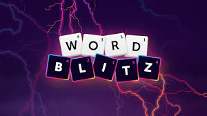

# Word Blitz Auto-Player

https://www.facebook.com/WordBlitzOriginal/

<p align="center">
  
</p>

> Built as a personal automation / computer vision experiment for recognizing and playing WordBlitz


This Python script helps solve and optionally auto-trace words on a 4x4 connected-letter word game board, similar to Boggle or Word Blitz.

- Manual mode, where you type the 16 board letters into a grid UI
- OCR mode, where the script captures the board from the screen and tries to recognize the letters automatically

The script then finds valid English words by walking connected tiles in any direction, including diagonals, without reusing the same tile in a word path. It can print the found words and optionally drag the mouse through the tile centers to submit them in the game.

## Main Features

- Draggable square capture guide for mapping the board area.
- Optional manual 4x4 letter entry UI.
- OCR-based letter recognition using Tesseract.
- Backup template matching using saved high-confidence letter images.
- Connected-word search across neighboring tiles.
- Prefix pruning for faster word search.
- Real-word filtering using `wordfreq` and a custom blocked-word list.
- Optional auto-tracing with PyAutoGUI.
- Pause popup every configured number of seconds.
- Optional template image saving for future OCR/template matching improvements.

## How It Works

1. A transparent capture guide appears.
2. You place the guide over the game’s 4x4 board.
3. The script maps each tile position to screen coordinates.
4. In manual mode, you type the board letters into the input window.
5. In OCR mode, the script captures the board and tries to recognize each letter.
6. The solver searches for connected English words.
7. Found words are printed from highest value to lower value, mostly based on word length.
8. If auto-tracing is enabled, the script moves and drags the mouse across each word path.
9. A popup can pause the script periodically so you can continue or quit.

## Installation

You need Python 3.9+, Tkinter, and Tesseract OCR.

### macOS prerequisites

Do **not** use the Python bundled with macOS or Apple Command Line Tools. That
Python may use the obsolete Tk 8.5 runtime, which can produce blank or partially
rendered guide windows on current macOS releases.

Install Homebrew if necessary, then install Homebrew Python 3.14, its matching
Tkinter package, and Tesseract:

```bash
brew install python@3.14 python-tk@3.14 tesseract
```

Verify that the Homebrew interpreter and Tkinter are available:

```bash
"$(brew --prefix python@3.14)/bin/python3.14" --version
"$(brew --prefix python@3.14)/bin/python3.14" -c "import tkinter; print(tkinter.TkVersion)"
```

The Tk version should be 8.6 or newer. If an existing `.venv` was created with
Apple's Python, delete it and recreate it using the Homebrew interpreter.

Clone the monorepo, enter this tool's directory, and install the app with:

```bash
git clone https://github.com/eric-r-xu/assortedTooling.git
cd assortedTooling/WordBlitzAutoPlay
rm -rf .venv  # Only needed when replacing an existing environment
"$(brew --prefix python@3.14)/bin/python3.14" -m venv .venv
source .venv/bin/activate
python -m pip install --upgrade pip
python -m pip install -e .
```

Confirm that the environment is using the intended runtime:

```bash
python --version
python -c "import tkinter; print(tkinter.TkVersion)"
```

### Windows and Linux installation

Clone the monorepo, enter this tool's directory, create an isolated environment,
and install the app:

```bash
git clone https://github.com/eric-r-xu/assortedTooling.git
cd assortedTooling/WordBlitzAutoPlay
python3 -m venv .venv
source .venv/bin/activate
python -m pip install --upgrade pip
python -m pip install .
```

On Windows, activate the environment with `.venv\Scripts\activate` instead.
The legacy `python -m pip install -r requirements.txt` command is still
supported and installs the same package metadata.

### Windows Tesseract install

Install Tesseract from the UB Mannheim build page, then make sure `tesseract.exe` is on your PATH.

If needed, add this near the top of the script:

```python
pytesseract.pytesseract.tesseract_cmd = r"C:\Program Files\Tesseract-OCR\tesseract.exe"
```

### Linux system packages

Package names vary by distribution. On Ubuntu/Debian, install Tesseract and
Tkinter before installing the Python package:

```bash
sudo apt-get install tesseract-ocr python3-tk
```

## Running the Script

```bash
wordblitz-autoplay
```

Running `python wordBlitz_autoplay.py` directly remains supported.

## Development

Install the package in editable mode with its development tools:

```bash
python -m pip install -e ".[dev]"
```

Build distributable wheel and source archives with:

```bash
python -m build
```

## Controls

### Capture Guide

- Drag the guide to move it.
- Use `+` or `-` to resize it.
- On macOS, use `Command` + `+` or `Command` + `-` to invoke the resize buttons.
- Use the mouse wheel to resize it.
- Press `Enter` or click `Start` to begin.
- Press `Escape` or click `Cancel` to stop setup.

### Manual Letter Picker

- Type one letter per box.
- Tab and Shift+Tab move between boxes.
- Backspace clears the current box or moves backward.
- Press `Enter` or click `Start` when all 16 letters are filled.
- Press `Escape` or click `Cancel` to cancel.

### Runtime Safety

- Move the mouse to the top-left corner to trigger the PyAutoGUI failsafe.
- Press `Ctrl+C` in the terminal to stop.
- Use the periodic popup to continue or quit.

## Important Settings

Most settings are at the top of the script.

### Board size

```python
GRID_SIZE = 4
```

### Manual mode

```python
USE_MANUAL_GRID_PICKER = True
MANUAL_GRID_RUN_ONCE = True
MANUAL_GRID_PREFILL_WITH_OCR = False
```

Set `USE_MANUAL_GRID_PICKER = False` to use OCR mode instead.

### Word filtering

```python
MIN_WORD_LENGTH = 2
WORD_FREQ_THRESHOLD = 2.3
REQUIRE_WORD_IN_DICTIONARY = True
```

The script uses a word list from `wordfreq` unless you provide your own file path with:

```python
WORD_LIST_PATH = None
```

### Custom words

Add words the game accepts here:

```python
CUSTOM_ALLOWED_WORDS = set()
```

Block unwanted words here:

```python
CUSTOM_BLOCKED_WORDS = {...}
```

### Auto-tracing

```python
AUTO_TRACE_FOUND_WORD = True
TRACE_ONLY_FIRST_WORD = False
MAX_WORDS_TO_TRACE = 80
```

Set `AUTO_TRACE_FOUND_WORD = False` to print words without moving the mouse.

### Trace speed

```python
TRACE_MOVE_DURATION = 0.014
TRACE_PAUSE_AFTER_WORD = 0.003
TRACE_STEP_PIXELS = 40
TRACE_STEP_DURATION = 0.0015
TRACE_START_HOLD_SECONDS = 0.028
TRACE_TILE_HOLD_SECONDS = 0.002
TRACE_END_HOLD_SECONDS = 0.021
```

Larger `TRACE_STEP_PIXELS` and smaller duration/hold values make tracing faster. The default settings are tuned to trace about 30% faster than the original conservative timings. If the game misses inputs, increase `TRACE_TILE_HOLD_SECONDS` or lower `TRACE_STEP_PIXELS`.

### Pause popup

```python
PAUSE_POPUP_EVERY_SECONDS = 10
PAUSE_POPUP_ENABLED = True
```

Set `PAUSE_POPUP_ENABLED = False` to disable the pause prompt.

### Template image saving

```python
SAVE_TEMPLATE_IMAGES = True
TEMPLATE_IMAGE_ROOT = "ocr_letter_templates_wordBlitz"
```

Saved templates are placed under:

```text
ocr_letter_templates_wordBlitz/
  high_confidence/
    A/
    B/
    ...
  low_confidence/
    UNKNOWN/
    A/
    B/
    ...
```

### Template matching

```python
USE_BACKUP_IMAGE_MATCHING = True
USE_TEMPLATE_MATCHING_FIRST = True
```

Template matching can improve letter recognition once enough high-confidence examples have been saved.

## macOS Permissions

For auto-clicking and screen capture, allow your terminal or Python app in:

```text
System Settings → Privacy & Security → Accessibility
System Settings → Privacy & Security → Screen Recording
```

## Troubleshooting

### Tesseract is not found

Check:

```bash
tesseract --version
```

If that fails, install Tesseract or add it to your PATH.

### The mouse clicks the wrong place

Re-run the script and align the capture guide tightly around the board.

### The game misses traced words

Try slower trace settings:

```python
TRACE_STEP_PIXELS = 20
TRACE_STEP_DURATION = 0.004
TRACE_TILE_HOLD_SECONDS = 0.01
TRACE_PAUSE_AFTER_WORD = 0.03
```

### Too many bad words are traced

Raise the frequency threshold:

```python
WORD_FREQ_THRESHOLD = 2.8
```

Or add unwanted words to `CUSTOM_BLOCKED_WORDS`.

## Notes

This script is intended for personal experimentation with OCR, screen automation, and word solving. Use it responsibly and follow the rules of any game or platform you use it with.
