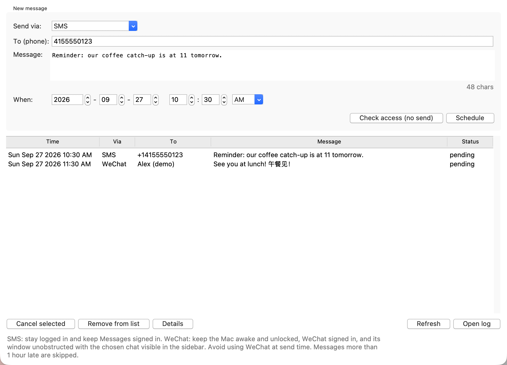
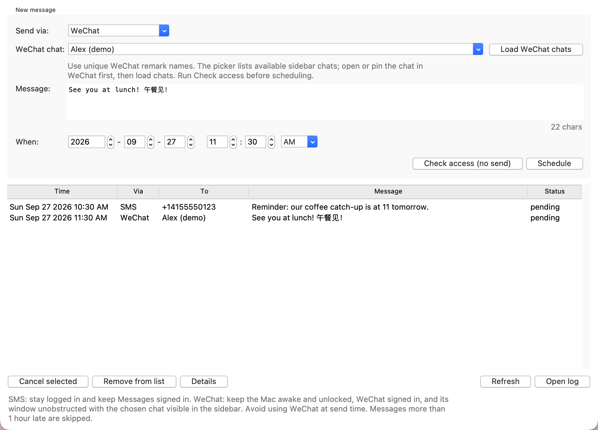

# SMS & WeChat Scheduler

Schedule a one-time message from your Mac using **Messages (SMS/iMessage)** or
**WeChat**. Choose a recipient, write your message, and pick a date and time.
The app can be closed afterward; macOS runs the scheduled job in the background.

**[Download the Mac app · v1.0.0 · 13.3 MB](downloads/SMS-WeChat-Scheduler-1.0.0-arm64.dmg?raw=true)**
· [SHA-256 checksum](downloads/SMS-WeChat-Scheduler-1.0.0-arm64.dmg.sha256)

**Requirements:** Apple Silicon Mac (M1 or newer), macOS 26 or newer, and a
signed-in Messages or WeChat account. Python is included in the download.
This is a macOS desktop app; it does not run in Docker, Windows, or Linux.



*Screenshots show the actual interface with fictional demo data. No messages
were sent to create them.*

## Install in a minute

1. Download and open the **DMG** linked above.
2. Drag **SMS & WeChat Scheduler** onto the **Applications** shortcut.
3. Eject the disk image and open the app from **Applications**.
4. Follow the setup for your messaging channel below, then run
   **Check access (no send)** before scheduling your first message.

The included build is ad-hoc signed, **not Apple-notarized**. If macOS blocks
it, attempt to open it once, then use **System Settings → Privacy & Security →
Open Anyway**, provided you trust this build. No administrator password or
Terminal command is needed by the scheduler itself; macOS controls installation
and permission prompts.

Keep the installed app in the same location while messages are pending.
Scheduled jobs refer to that app's executable.

## Schedule an SMS or iMessage

1. Open **Messages** on your Mac and sign in. For SMS, enable text message
   forwarding from your iPhone to this Mac and confirm you can send manually.
2. In the scheduler, leave **Send via** set to **SMS**.
3. Enter a 10-digit US phone number, or an international number beginning
   with `+` and its country code.
4. Click **Check access (no send)**. Allow access to Messages if macOS asks.
   Wait for the check result before continuing.
5. Type your message and choose a future date and time in your Mac's local time.
6. Click **Schedule**. The message appears in the list with status `pending`.

The **SMS** option uses a usable SMS account in Messages, falling back to
iMessage when an SMS account is unavailable. It does not force a particular
delivery service.

## Schedule a WeChat message



1. Open and sign in to the **personal WeChat Mac app**. Open the intended chat
   so it appears in the main Chats sidebar; pin it if helpful.
2. Select **WeChat** under **Send via**, click **Load WeChat chats**, and choose
   the exact conversation.
3. Click **Check access (no send)**. This selects the chat and verifies an empty
   composer without typing or sending. The chat remains open afterward.
4. When prompted, allow **Accessibility** for the app/process macOS identifies
   and **Automation → System Events** under **System Settings → Privacy &
   Security**. Run the check again if permissions were just changed.
5. Enter your message, choose a future local date/time, and click **Schedule**.

Use unique contact remark names. Chat matching uses visible names, not permanent
WeChat account IDs. Duplicate names, renamed contacts, existing drafts, off-screen
chats, or a changed WeChat interface can prevent sending. The picker omits
duplicate names. The integration was developed against WeChat 4.1.13 for macOS;
other versions or interface languages may require changes to `wechat.js`.

## At the scheduled time

- Keep your Mac **awake and logged in**, with the chosen messaging app signed in.
- For **WeChat**, also keep the Mac **unlocked**, the main chat window visible
  and unobstructed, and the target chat visible in the sidebar. Avoid using
  WeChat while a scheduled message is being sent.
- You may close the scheduler window. Do not move or delete its installed app.
- Space WeChat messages at least two minutes apart. Overlapping operations are
  rejected to prevent competing for the interface.
- Messages more than **one hour late** are skipped. Failed sends are not
  automatically retried; inspect the messaging app before scheduling a replacement.

## Manage messages

Select a row, then use **Cancel selected** to cancel a pending message,
**Details** to inspect its result, or **Open log** for troubleshooting.
**Remove from list** clears a finished entry; cancel pending entries first.

| Status | Meaning |
| --- | --- |
| `pending` | Waiting for its scheduled time. |
| `sending` | A background process has claimed the message. |
| `sent` | Messages accepted the send command; recipient delivery is not confirmed. |
| `submitted` | WeChat's Send button was clicked and its composer cleared; recipient delivery is not confirmed. |
| `failed` | Inspect **Details** and the messaging app before trying again. |
| `missed` | Skipped because it was more than one hour late. |
| `cancelled` | Cancelled before sending. |
| `checked` | A developer dry run completed without sending. |

## Troubleshooting

| Problem | What to try |
| --- | --- |
| macOS will not open the downloaded app | Use **Privacy & Security → Open Anyway** if you trust this unnotarized build. |
| The app asks to be installed | Drag it to **Applications**, eject the DMG, and launch the installed copy. |
| Access check fails or times out | Look for permission prompts, check Accessibility/Automation settings, then repeat the check in the scheduler. Permission from a Terminal session may not cover background jobs. |
| WeChat chat is missing | Sign in, select Chats, open or pin the conversation, and click **Load WeChat chats** again. Give duplicate contacts unique remark names. |
| WeChat reports an existing draft | Review or clear the draft yourself. The scheduler refuses to overwrite it. |
| A message failed | Read **Details** and check the messaging app before rescheduling; submission may already have happened. |
| A message is still `sending` after an interruption | Inspect the messaging app and log before taking action; the app does not automatically retry an uncertain send. |
| An old schedule is missing from this app | The DMG app has its own data directory. Manage source-installation jobs in the old scheduler. |

## Data, upgrades, and removal

The installed app keeps message text, recipients, status, and logs locally in:

```text
~/Library/Application Support/SMS & WeChat Scheduler/
```

Treat that directory as personal data; the JSON job file is not encrypted by
the scheduler. Background job definitions live in
`~/Library/LaunchAgents/com.local.smswechatscheduler.job.*.plist`.

**Existing source installations:** the app starts with a separate, empty message
list. Existing jobs remain active and unchanged. Manage or cancel them in the
old scheduler, and avoid scheduling the same message in both installations.

**Upgrade:** quit the app and replace it at the same path, while no send is
running. Jobs and logs remain in the data directory.

**Uninstall:** cancel all pending messages in the app, then move the app to Trash.
You can retain or delete its data directory afterward.

## Run from source

Use macOS with Python 3.14 and Tkinter available. There are no third-party Python
runtime packages to install. `python3 -m tkinter` can check your Tkinter setup.

```sh
cd smsScheduler  # from the repository root
python3 app.py
```

Source mode stores `jobs.json` and logs alongside the source and uses the legacy
`com.user.smssched.*` launch agent names. Keep the source directory and Python
interpreter in place while its jobs are pending. Use one source installation at
a time; source copies share those launch agent names.

## Rebuild the app

To rebuild on an Apple Silicon Mac running macOS 26+, with Python 3.14 and Tkinter:

```sh
python3 -m venv .venv-build
.venv-build/bin/python -m pip install -r requirements-build.txt
.venv-build/bin/python build_dmg.py
```

The build creates an app, DMG, and SHA-256 checksum in `dist/`. It verifies the
app signature and checks the DMG. The disk image includes this README and its
screenshots. After installing a new build, run **Check access (no send)** in
the app before scheduling messages.

Set `MACOS_SIGNING_IDENTITY` to an available Developer ID Application identity
to sign a new build with your certificate. Apple notarization is a separate
distribution step. Intel Macs and older macOS versions require separate builds
and validation.

The download in this repository is the original v1.0.0 DMG, unchanged from the
initial build. Its included installation notes predate this illustrated README.
New builds include the updated README and images. Build output is ignored by Git;
copy a verified release and its checksum into `downloads/` when publishing an update.

## Files in this folder

| Files | Purpose |
| --- | --- |
| `downloads/` | Installable DMG and matching SHA-256 checksum. |
| `docs/images/` | SMS and WeChat interface screenshots using fictional data. |
| `app.py` | Desktop form, message list, and user actions. |
| `scheduler.py`, `runner.py` | Background job setup, routing, timing, and results. |
| `store.py`, `runtime_paths.py` | Locked JSON storage and source/bundle paths. |
| `send.applescript` | Messages account selection and SMS/iMessage sending. |
| `wechat.py`, `wechat.js` | Serialized WeChat automation and recipient/draft checks. |
| `bundle_main.py` | App entry point for the GUI and bundled background runner. |
| `build_dmg.py`, `SMSWeChatScheduler.spec`, `requirements-build.txt` | Repeatable macOS packaging. |
| `packaging/entitlements.plist` | macOS automation entitlement for the bundled app. |

Personal job data, build environments, caches, obsolete installation scripts,
and test/diagnostic helpers are not included.
